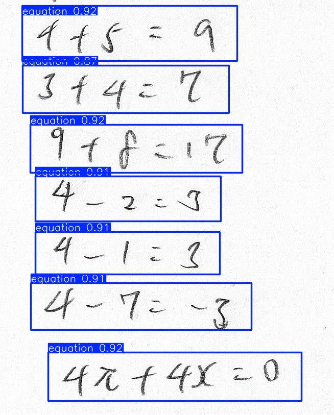

# 手書き数式構造検出AI (YOLOv8)

YOLOv8を用いて、手書き数式の画像から **式 (equation)**、**分数 (fraction)**、**分数バー (bar)** を自動検出するオブジェクト検出モデルです。  
合成データを用いた転移学習により、複雑な手書き数式の構造要素をリアルタイムで識別します。

## 主な機能

* **合成データによる学習**: 既存の文字データセットからランダムに数式を合成し、3,000枚規模の学習データを自動生成。
* **構造要素の特定**: 単なる文字認識の前段として、数式全体の範囲や分数の構造を正確に切り出します。
* **YOLOv8n 転移学習**: 軽量で高速なYOLOv8nモデルを採用し、高精度な検出と実用的な推論速度を両立。
* **自動パイプライン**: データの生成・分割から、学習、モデルの整理、テスト推論までをJupyter Notebook上で完結。

## 検出イメージ

モデルは入力画像内の数式領域を検出し、以下のクラスに分類します。
- `equation`: 数式全体のバウンディングボックス
- `fraction`: 分数部分のバウンディングボックス
- `bar`: 分数線のバウンディングボックス

*画像内の数式領域をバウンディングボックスで特定します*

## 使用データセットとライセンス

本プロジェクトでは、以下のデータセットを利用しています。

### 1. HASYv2 Dataset
* **内容**: 手書きの数学記号データセット。
* **ライセンス**: [CC BY-SA 4.0](https://creativecommons.org/licenses/by-sa/4.0/)
* **引用**: Thoma, M. (2017). The HASYv2 dataset. arXiv preprint arXiv:1701.08380.

### 2. MNIST Dataset
* **内容**: 手書き数字データセット。
* **ライセンス**: [CC BY-SA 3.0](https://creativecommons.org/licenses/by-sa/3.0/) (Yann LeCun, Corinna Cortes and Christopher J.C. Burges)

## 🛠 動作環境

| 項目 | バージョン / 詳細 |
| :--- | :--- |
| **OS** | Windows 11 |
| **Python** | 3.13.9 |
| **Deep Learning** | PyTorch 2.6.0, Ultralytics 8.4.21 |
| **Computer Vision** | OpenCV 4.13.0.92 |
| **GPU Support** | CUDA対応（利用可能な場合、自動的にGPUを使用） |

